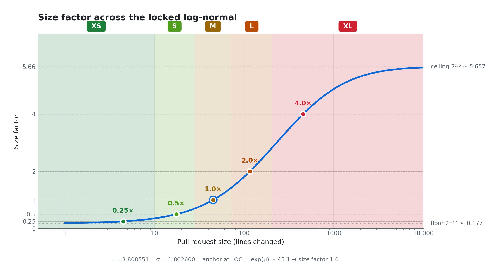
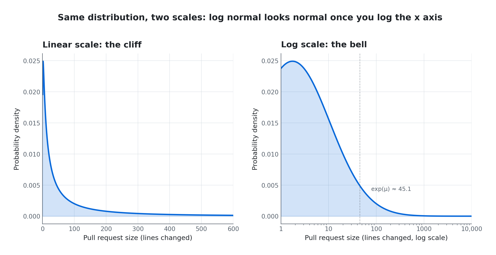
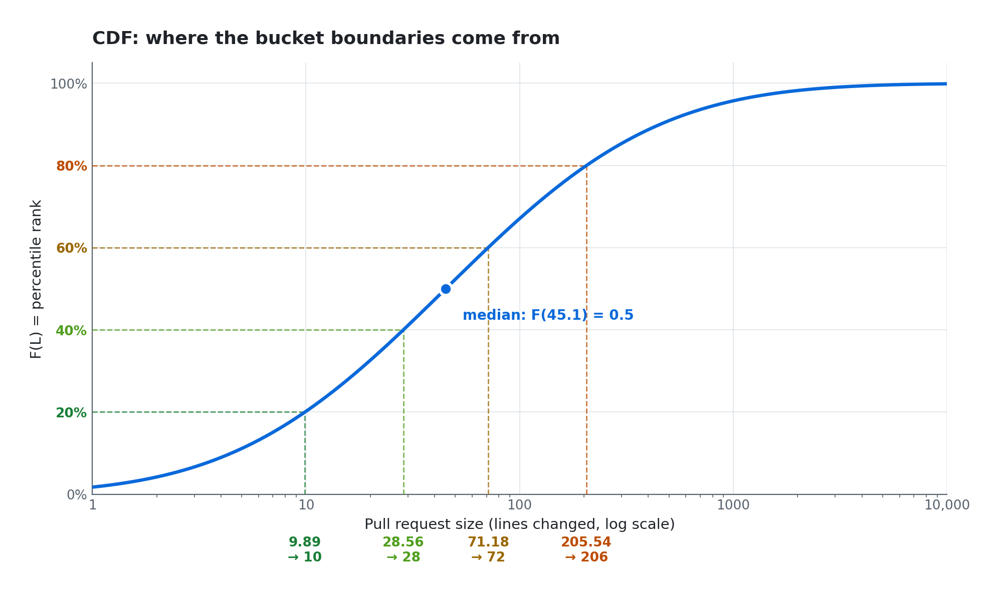
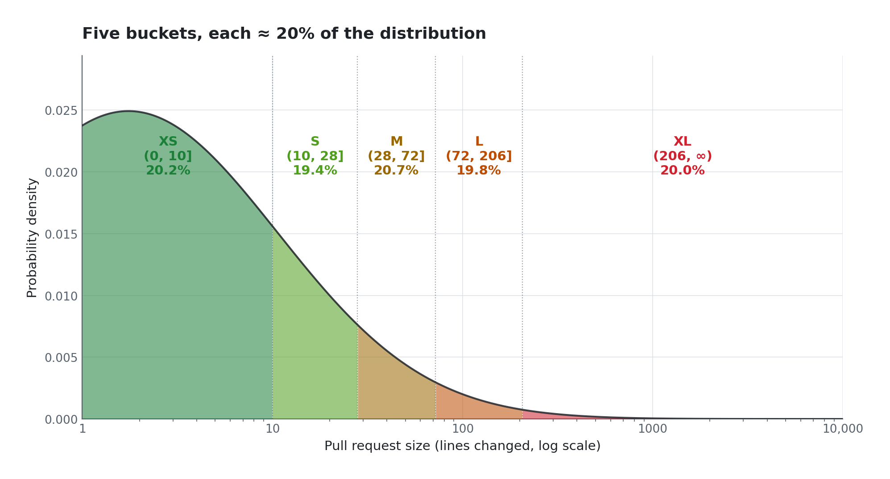
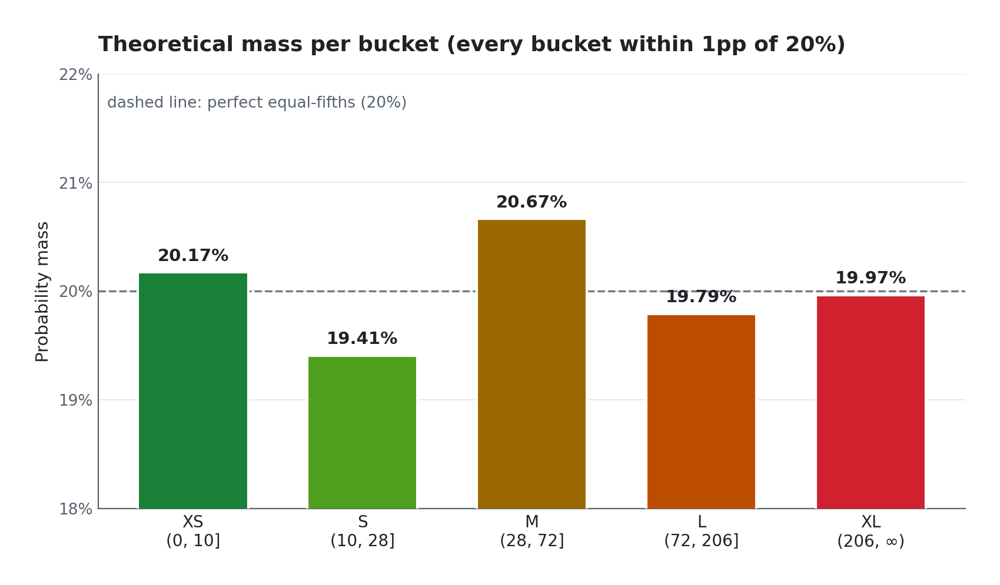
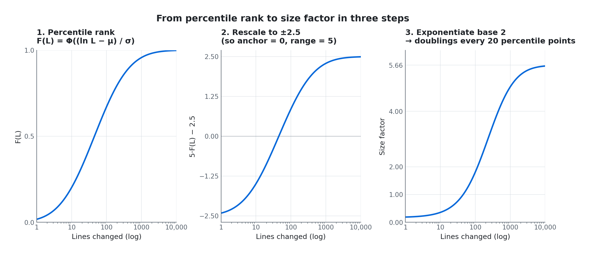
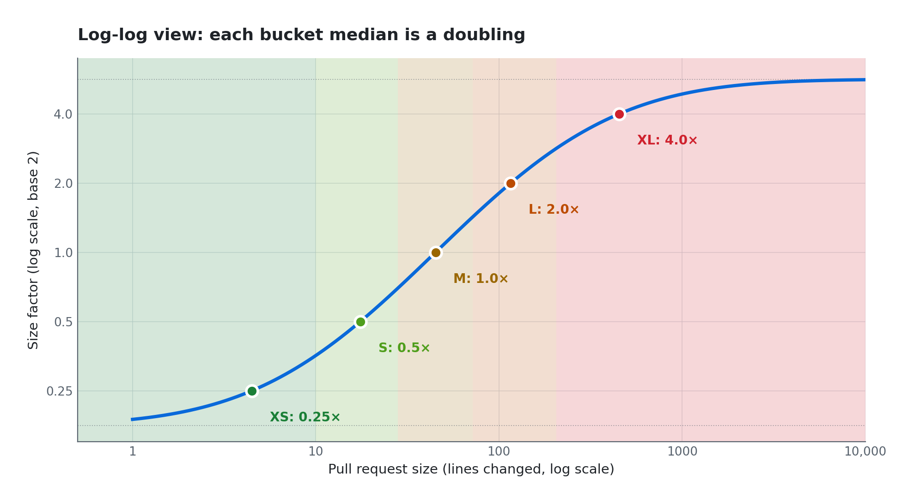
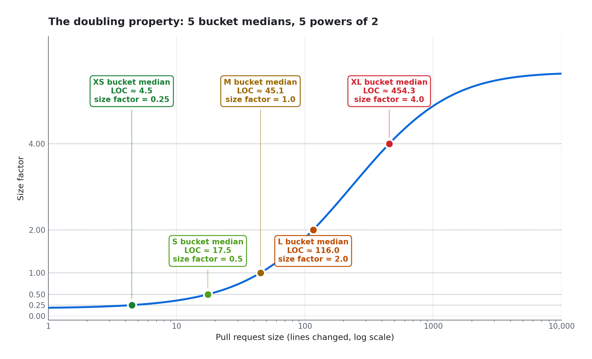

# laserlemon/cru

The canonical Go implementation of the Code Review Unit (CRU) formula.

[](https://github.com/laserlemon)
[](https://github.com/laserlemon/cru/tags)
[](https://github.com/laserlemon/cru/actions/workflows/ci.yml)

A CRU is a unit of code-review effort. One CRU equals the work of reviewing
a typical pull request, where "typical" is anchored to a locked reference
distribution of real merged pull requests. The unit is stable across time:
a CRU today and a CRU five years from now mean the same thing.

<picture>
  <source media="(prefers-color-scheme: dark)" srcset="docs/img/size-factor-hero-dark.png">
  
</picture>

This package is the formula by itself. To measure code review effort for
GitHub pull requests, see [`gh-cru`](https://github.com/laserlemon/gh-cru),
a GitHub CLI extension.

## Install

```bash
go get github.com/laserlemon/cru
```

## Quick start

```go
import "github.com/laserlemon/cru"

// A 250-line pull request, the reviewer owns 100 lines of it, low risk.
cru.Calculate(250, 100, cru.RiskLow) // => 1.2510...

// The size value carries both its factor and its label.
sz := cru.CalculateSize(250)
sz.Factor() // => 3.1275...
sz.String() // => "XL"
```

## Formula

```
CRU = size factor × ownership share × risk multiplier
```

### Size factor

Bigger pull requests are harder to review, but not linearly: a 1000-line
review isn't 100× the effort of a 10-line review. The size factor is a
smooth, continuous function of line count, anchored at 1.0 for a typical
pull request. It ranges from about 0.18 for a one-liner to about 5.66
for an enormous refactor. The exact curve comes from a log-normal fit
of merged pull request sizes in a large monolithic GitHub repository,
locked once and never re-tuned.

Pull request sizes are log-normal, which means the raw distribution
looks like a cliff but flips into a clean bell once you put the x axis
on a log scale:

<picture>
  <source media="(prefers-color-scheme: dark)" srcset="docs/img/distribution-linear-vs-log-dark.png">
  
</picture>

The t-shirt scale (XS, S, M, L, XL) is post-hoc labeling for display.
Each step up the scale corresponds to a doubling of the size factor,
but the underlying number is continuous, not bucketed.

### Ownership share

A number between 0 and 1: how many of the pull request's lines you're
responsible for. If you own all of the pull request's changed files via
CODEOWNERS, your share is 1.0 and you carry the full size factor. If you
own 100 of 250 changed lines, your ownership share is 0.4.

### Risk multiplier

Three tiers: 1× for low (default), 2× for medium, 4× for high.
Authors may flag pull requests that touch sensitive paths, where the
same line count deserves more rigorous review. By default, an unflagged
pull request is considered low risk.

## API

### Functions

#### `cru.Calculate`

```go
func Calculate(totalLines, ownedLines int, risk Risk) float64
```

Returns the full CRU for a single (reviewer, pull request) pair. This is
the headline function: `CalculateSize(totalLines).Factor() × (ownedLines
/ totalLines) × risk.Multiplier()`. Returns 0 when `totalLines` is 0. Clamps
`ownedLines` to `[0, totalLines]` so callers can't double-count overlap
or pass a negative share. Panics if `risk` is nil.

#### `cru.CalculateSize`

```go
func CalculateSize(lines int) Size
```

Returns just the size factor for a given line count, without ownership
or risk applied. Useful when you want the raw size measurement (the
"how big is this PR" question) decoupled from any particular reviewer.
At `lines ≤ 0` returns the bounded floor (about 0.18) instead of zero,
keeping the function total.

### Types

#### `cru.Size`

```go
type Size float64
```

A pull request's size factor. The `float64` value is the factor itself;
the categorical t-shirt label is derived from it and surfaced via
`String()`. Read the numeric value via `Factor()`, which is equivalent
to `float64(s)`.

Construct via `CalculateSize`. Direct conversion (`cru.Size(0.5)`) is
legal but the resulting label is whatever bucket the equivalent line
count falls into.

#### `cru.Risk`

```go
type Risk interface { ... }
```

A pull request's risk tier. The interface is sealed: only the three
exported constants (`RiskLow`, `RiskMedium`, `RiskHigh`) satisfy it,
and external packages can't construct alternatives. Values are
comparable via `==` and `switch`, so a callsite like:

```go
switch r {
case cru.RiskHigh:   // ...
case cru.RiskMedium: // ...
default:             // low
}
```

is provably exhaustive.

### Constants

```go
cru.Mu    = 3.808551     // log-normal μ
cru.Sigma = 1.802600     // log-normal σ

cru.RiskLow    // factor 1.0, the default
cru.RiskMedium // factor 2.0, author-tagged
cru.RiskHigh   // factor 4.0, author-tagged

cru.SizeXS // "XS"
cru.SizeS  // "S"
cru.SizeM  // "M"
cru.SizeL  // "L"
cru.SizeXL // "XL"
```

The size constants are exactly the strings `Size.String()` returns. Switch on
them in downstream code instead of bare string literals.

## Calibration

The size factor is a continuous function, but t-shirt labels need
cutoff points. Those cutoffs are the four equal-mass quintile
boundaries of the locked log-normal: the lines at the 20th, 40th,
60th, and 80th percentiles of the baseline distribution. The raw
quintile cuts split the log-normal into exact equal fifths; the
shipped cuts deviate from those raw values for the rounding reason
described below.

<picture>
  <source media="(prefers-color-scheme: dark)" srcset="docs/img/cdf-with-quintiles-dark.png">
  
</picture>

The raw cuts are computed at package init from `Mu` and `Sigma`, then
each is rounded to the nearest even integer:

| Size | Percentile range | Raw bound | Raw mass | Final bound | Final mass |
|---|---|---|---|---|---|
| XS | (0%, 20%]   | (0, 9.89]       | 20.00% | (0, 10]    | 20.17% |
| S  | (20%, 40%]  | (9.89, 28.56]   | 20.00% | (10, 28]   | 19.41% |
| M  | (40%, 60%]  | (28.56, 71.18]  | 20.00% | (28, 72]   | 20.67% |
| L  | (60%, 80%]  | (71.18, 205.54] | 20.00% | (72, 206]  | 19.79% |
| XL | (80%, 100%] | (205.54, ∞)     | 20.00% | (206, ∞)   | 19.97% |

<picture>
  <source media="(prefers-color-scheme: dark)" srcset="docs/img/distribution-with-buckets-dark.png">
  
</picture>

Why even? Real pull requests have jagged line counts: peaks at even
counts (every full-line edit contributes both a `-` and a `+` to the
diff), valleys at odd. By rounding boundaries to even numbers, every
bucket gets an equal share of even line counts (peaks) and odd line
counts (valleys). Labels stay balanced no matter how jagged the
underlying distribution is, with every final bucket landing within one
point of perfect equal-fifths.

<picture>
  <source media="(prefers-color-scheme: dark)" srcset="docs/img/bucket-mass-dark.png">
  
</picture>

The constants are locked. Like a foot, the value of the unit is in the
unchanging standard, not in how closely it matches any current reality.

## How the size factor is built

The size factor is `2^(5·F(L) − 2.5)`, where `F(L) = Φ((ln L − μ) / σ)`
is the pull request's percentile rank in the locked distribution. Three
steps from raw line count to size factor:

<picture>
  <source media="(prefers-color-scheme: dark)" srcset="docs/img/size-factor-derivation-dark.png">
  
</picture>

The base-2 exponent and the `5·F − 2.5` rescaling are picked together so
that the median pull request scores exactly `1.0` and each successive
bucket median doubles the previous. Plotting the size factor on a log
axis makes the doubling property visible: the five bucket medians sit on
evenly-spaced horizontal gridlines.

<picture>
  <source media="(prefers-color-scheme: dark)" srcset="docs/img/size-factor-log-log-dark.png">
  
</picture>

The five anchors are the only properties locked into the unit. Every
other shape (the sigmoid, the floor, the ceiling, the bucket
boundaries) falls out of `μ`, `σ`, and the requirement that the bucket
medians land on consecutive powers of two.

<picture>
  <source media="(prefers-color-scheme: dark)" srcset="docs/img/doubling-anchors-dark.png">
  
</picture>

The graphs above are rendered by [`scripts/render-graphs.py`](scripts/render-graphs.py)
and use a GitHub Primer palette in both themes. Re-run after any change
to `Mu` or `Sigma` to keep the visuals in sync with the code.
